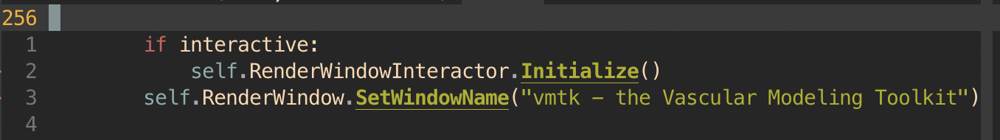
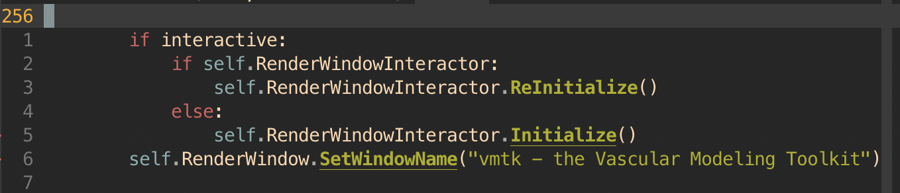

## Installation

1. Setup virtual environment (miniconda/miniforge recommended)

2. Install prerequisites (vmtk, simpleitk)

        conda update conda
        conda config --set restore_free_channel true
        conda create -n foo -c conda-forge python=3.9
        conda activate foo
        conda install -c conda-forge numpy=1.22.3 vtk=9.1.0 itk=5.2.0 vmtk=1.5.0
        conda install -c conda-forge simpleitk

    **Note:** If you are using a Mac with the new Apple Silicon (e.g. M1), 
    you will have to create an environment that runs rosetta. 
    Run the following lines instead:

        conda update conda
        conda config --set restore_free_channel true
        CONDA_SUBDIR=osx-64 conda create -n foo_rosetta python=3.9
        conda activate foo_rosetta
        conda config --env --set subdir osx-64
        conda install -c conda-forge vtk=9.1.0 itk=5.2.0 vmtk=1.5.0
        conda install -c conda-forge simpleitk

    **Note:** If you are using Ubuntu/Linux you might experience the render
    window freezing when running the meshing scripts. If so please change the
    following lines in the vmtkrenderer.py file. 

    

    

    tip: find the vmtk folder by running this in your vmtk virtual environment

        python -c "from vmtk import vmtkscripts; print(vmtkscripts.__file__)"

3. Clone environment using Git 

        git clone https://github.com/isaiahchua/MeshingScriptsV2.git

## Python Scripts

**view.py**

High-level wrapper for quickly viewing vessel centerlines, surfaces and meshes

Example usage:
    
    python view.py -c example_data/centerlines/aorta_clnet2.vtp

For additional help:

    python view.py -h

